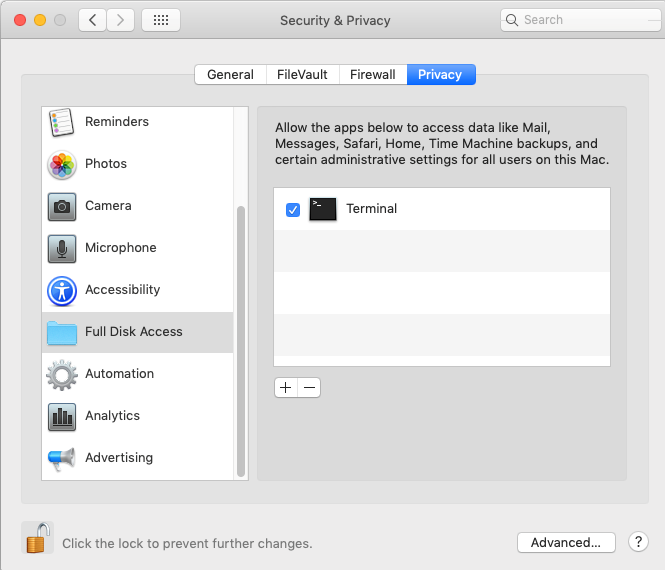

# macOS Artifact Collector (macosac)

This is a DFIR tool for collecting artifact files on macOS. The "Extended Attributes" of artifact files are collected too.
Furthermore, this tool can collect artifacts in Time Machine backups as well as ones on the current disk.
This tool does not provide features for analyzing artifacts, so you can analyze them with your favorite artifact analyzing tools.

## Requirement

- Python 2.7.x
- Python 3.x

Yes, "Python 2.7". Not "Python 3.7". Although I know that Python 2.7 has been already dead, We can not install additional tools to a victim machine from a forensic perspective. But, it has been installed by default, so we have to take full advantage of it for DFIR.

## Installation

Download scripts from this repository to an analyst's computer.

```bash
$ git clone https://github.com/mnrkbys/macosac.git
```
Then, copy files above to an USB thumb drive or a external SSD drive.

Besides, Terminal.app has to be allowed "Full Disk Access" on victim computers.



## Building native binaries

Actually, macOS 12.3 or later do not come with a Python runtime. So, I strongly recommend using a native binary version of macosac, if you run on that environments.

If you need to a build native binary from macosac.py. You have to install Python modules below:

- Nuitka
- zstandard
- xattr
- ordered-set (if you want)

```shell
% nuitka3 --follow-imports --onefile --onefile-tempdir-spec='./temp_%PID%_%TIME%/' macosac.py
% ls -al macosac.bin 
-rwxr-xr-x  1 macforensics  staff  6814812  5 27 16:00 macosac.bin
```

Unfortunately, Nuitka does not support yet cross compilation or building universal binaries. If you need ARM64 binaries for Apple Silicon Macs, you have to ready the hardware.

## Usage

```bash
$ sudo python2.7 ./macosac.py -h
usage: macosac.py [-h] [-o OUTPUTDIR] [-t OUTPUTTYPE] [-l] [-c CATEGORIES]
                  [-ls] [-tm] [-ts TIMESTAMP] [-tz TIMEZONE] [-vn VOLUMENAME]
                  [--use-builtincopy] [--debug]

Collects macOS forensic artifacts.

optional arguments:
  -h, --help            show this help message and exit
  -o OUTPUTDIR, --outputdir OUTPUTDIR
                        Output directory for collected artifacts
  -t OUTPUTTYPE, --outputtype OUTPUTTYPE
                        Output type: dir, dmg or ro-dmg. "ro-dmg" means "Read
                        Only DMG". Converts a regular dmg to UDRO format after
                        collecting artifacts. (default: dir)
  -l, --list            List categories which are defined in macosac.ini
  -c CATEGORIES, --categories CATEGORIES
                        Specify comma separated categories (default: all).
  -ls, --localsnapshots
                        Retrieve artifacts from local snapshots.
  -tm, --timemachine    Retrieve artifacts from Time Machine bakcups.
  -ts TIMESTAMP, --timestamp TIMESTAMP
                        Specify the timestamp of localsnapshots/Time Machine
                        backups to start collecting: YYYY-MM-DD-hhmmss
                        (default: 0000-00-00-000000 It means to collect all
                        backups)
  -tz TIMEZONE, --timezone TIMEZONE
                        Timezone: e.g. UTC0, JST-9 (default: UTC0)
  -vn VOLUMENAME, --volumename VOLUMENAME
                        Disk volume name macOS is installed (default:
                        'Macintosh HD')
  --use-builtincopy     Use a built-in copy function instead of rsync.
  --debug               Enable debug mode.
```

## Analyze collected artifacts

macOS Artifact Collector can only collect artifacts. Therefore, you need to use other tools for analyzing them such as tools below:

- mac_apt [https://github.com/ydkhatri/mac_apt](https://github.com/ydkhatri/mac_apt)
- AutoMacTC [https://github.com/CrowdStrike/automactc](https://github.com/CrowdStrike/automactc)
- APOLLO [https://github.com/mac4n6/APOLLO](https://github.com/mac4n6/APOLLO)
- Blacklight [https://www.blackbagtech.com/products/blacklight/](https://www.blackbagtech.com/products/blacklight/)
- AXIOM [https://www.magnetforensics.com/products/magnet-axiom/](https://www.magnetforensics.com/products/magnet-axiom/)

## Demo

Acquire artifacts on macOS 10.14, then analyze them on macOS 10.15 with AutoMacTC. This demo movie was made for Japan Security Analyst Conference 2020 (JSAC2020)


## Convert DMG to E01

If you collect artifacts into a DMG file (using option "dmg" or "ro-dmg"), you can convert it into E01.

```bash
$ brew install libewf
$ hdiutil attach -nomount xxxxxx_YYYYMMDD_hhmmss.dmg
$ diskutil list    -> confirm device name which DMG has been mounted
$ ewfacquire -t evidence -v /dev/disk4s1    -> create evidence.E01 from /dev/disk4s1
$ hdiutil detach /dev/disk4
```

## TODO

- [X] Support Python 3.x
- [ ] Acquire live information (e.g. last, netstat, ps, lsof, and so on)
- [ ] Cooperate with [TrueTree](https://github.com/themittenmac/TrueTree)
- [ ] Cooperate with [KnockKnock](https://github.com/objective-see/KnockKnock)
- [ ] Acquire binary files which are specified in Launch Daemons/Agents plist files
- [ ] Create System volume and Data volume in one dmg file (for macOS 10.15+)
- [ ] Record file timestamps as UTC instead of local time
- [X] Consider how to build native binaries
- [ ] Acquire more information

## Author

[Minoru Kobayashi](https://twitter.com/unkn0wnbit)

## License

[Apache License, Version 2.0](http://www.apache.org/licenses/LICENSE-2.0)
